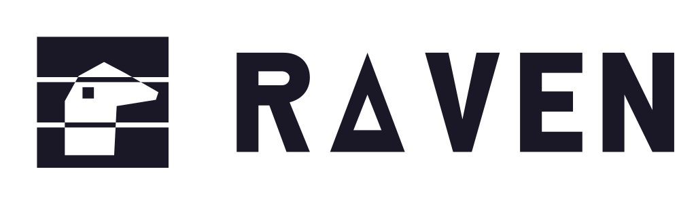

<div align="center">

<picture>
  <source media="(prefers-color-scheme: dark)" srcset="assets/brand/png/raven-logo-512.png">
  
</picture>

**A real Windows installation, mounted as C:, with its programs launched from Linux.**

</div>

[](LICENSE)
[](https://github.com/Project-Colony/Colony)
[](#installation)

Wine and Proton run Windows programs against a *synthetic* Windows: a prefix Wine
created, a registry Wine wrote as a text file, and reimplementations of the
libraries a program expects to find. It works remarkably well, and it is why the
prefix is disposable. It also means the program's whole world is a reconstruction.

Raven keeps Wine where Wine is irreplaceable - translating NT calls into Linux
syscalls - and replaces everything above it with a genuine Windows installation
that you deploy, mount read-only, and write to through an overlay. The registry
comes from real hives. The libraries are Microsoft's, except for the precise set
that physically cannot be.

> **Status:** the end-to-end story exists. A real Windows 11 Pro deploys from
> an official ISO, mounts as C:, a real installer wrote 256 MB into an
> environment without touching a byte of the base - and the game it installs
> runs from a double-click in a file manager to its title screen. The registry
> projection carries 1 894 keys from the real hives, a launch into an
> already-running session costs about 2 ms of Raven's own overhead, and the
> shadow set is down to a single entry - the fonts mask that bought the older
> spawn figures was withdrawn, because a Windows declaring 961 fonts and having
> none is not the real thing.
>
> What that does *not* mean: two games, the first 2D and software-rendered,
> which turned out to render through GDI and never touch Direct3D at all, the
> second drawing on the GPU through DXVK and Direct3D 11; vkd3d-proton installs,
> but no Direct3D 12 title has been tried; one installer framework exercised;
> programs that keep their strings in `.mui` files run mute. The honest ledger,
> including five performance theories that measurement destroyed, is in
> [docs/project/status.md](docs/project/status.md) and
> [docs/internals/performance.md](docs/internals/performance.md).

## Why Raven

What you would otherwise reach for, and where it stops:

- **Wine / Proton** - the program runs at native speed, but inside an invented
  Windows. Software that reads its own installation state, resolves COM servers
  it registered at install time, or expects a library Wine has only partly
  reimplemented, finds an environment that does not quite add up.
- **A virtual machine** - perfect fidelity, because it is really Windows. It is
  also a second computer: its own RAM, its own filesystem, its own GPU story, and
  a window that is a screen rather than an application. That is isolation, which
  is the opposite of what Raven is for.
- **Bottles, Lutris, umu** - the best tooling that exists around a Wine prefix:
  runner and DXVK versions, dependency installers, store integration, and years
  of accumulated per-title fixes. Raven has none of that and is not competing for
  it. They make a synthetic Windows far easier to live with; they do not change
  what it is.

Raven's position is the one nobody occupies:

```
                    program's own code   →  runs natively on your CPU
                    ─────────────────────────────────────────────────
  Wine / Proton     invented Windows     →  Wine's prefix, text registry
  Virtual machine   real Windows         →  behind a hypervisor, isolated
  Raven             real Windows         →  mounted directly, as your C:
                    ─────────────────────────────────────────────────
                    NT → Linux syscalls  →  Wine, in every case; no alternative
```

## What it does

- **Deploys a real Windows without a VM and without booting it.** An official
  Microsoft ISO carries `sources/install.wim`; `wimlib` applies it straight to a
  directory from Linux. No hypervisor, no installer, no first-boot.
- **Mounts that installation read-only, and writes through an overlay.** The base
  is immutable and shared; every environment is an `overlayfs` upper layer on top
  of it. Discarding an environment is deleting a directory, and the base is
  incapable of being damaged by anything a program does.
- **Projects the real registry.** Windows keeps the registry in binary hives;
  Wine keeps it as text. Raven reads the hives and projects the parts that
  describe *software* into the prefix, deliberately leaving out the parts that
  describe *hardware and drivers* that do not exist here.
- **Shadows only the libraries it must.** `ntdll` and `win32u` are the boundary
  where Windows talks to a kernel that is not present; those are Wine's, and no
  design can change that. How far above them Microsoft's own libraries can be
  used is an open measurement, and it is the question Raven exists to answer.
- **Registers `.exe` with the kernel.** `binfmt_misc` makes `./program.exe` an
  executable like any other, resolved to the environment it belongs to.

## Installation

There are two binaries because there are two front ends. `raven` is the command
line and the primary interface; `raven-gui` is a window over the same library -
environments, bases and diagnostics - and nothing here requires it. Whichever
way you install, Raven needs `wine` and `wimlib` at runtime.

### Via Colony (recommended)

Search for **Raven** in [Colony](https://github.com/Project-Colony/Colony) and
install it. Colony installs `raven-linux`, the command line, checks its
signatures and keeps it updated.

Two things Colony does not do. It does not register `.exe` files with the
kernel: that needs root once, through the Arch package below or the lines
`raven binfmt` prints. And it does not install `raven-gui`: take that from the
release page if you want the window.

### Direct binary download

Grab the assets from the [latest release](../../releases/latest):

| Asset | What it is | Signature files |
|---|---|---|
| `raven-linux` | the command line, `raven` | `raven-linux.sig`, `raven-linux.meta`, `raven-linux.meta.sig` |
| `raven-gui-linux` | the window, `raven-gui` | `raven-gui-linux.sig`, `raven-gui-linux.meta`, `raven-gui-linux.meta.sig` |

`raven-gui` runs `raven` from your `PATH`, so install the command line under
that name:

```bash
install -Dm755 raven-linux ~/.local/bin/raven
install -Dm755 raven-gui-linux ~/.local/bin/raven-gui
raven doctor
```

[Code signing policy](#code-signing-policy) shows how to check the signatures
before you run them. As with Colony, the `.exe` registration is then yours to
install (`raven binfmt` prints it).

### Build from source

On Arch, the package in [packaging/](packaging/) installs both binaries,
registers `.exe` files with the kernel, and masks Wine's competing
registration - be aware that **installing changes what every `.exe` on the
machine does**, and uninstalling reverses it:

```bash
git clone https://github.com/Project-Colony/Raven
cd Raven/packaging
makepkg -si
```

Everywhere else, build with cargo - short, but the `.exe` registration is then
yours to install (`raven binfmt` prints it):

```bash
git clone https://github.com/Project-Colony/Raven
cd Raven
cargo build --release
```

Requires Rust 1.88 or newer, plus `wine` and `wimlib` at runtime. The full list,
and what each is for, is in
[docs/internals/system-dependencies.md](docs/internals/system-dependencies.md);
`raven doctor` reports what is missing - including who actually gets a
double-clicked `.exe`.

Then [docs/guide/usage.md](docs/guide/usage.md) walks from an ISO to a running
program.

## Documentation

Full documentation is in [docs/](docs/) - start at [docs/README.md](docs/README.md).

The two pages that carry the argument are
[project/landscape.md](docs/project/landscape.md), for why this is worth
building at all, and [internals/architecture.md](docs/internals/architecture.md),
for how it is put together.

## Code signing policy

Every release asset is signed by the Project Colony organisation in CI, never on
a developer machine. Next to each asset on the release page:

| File | What it is |
|---|---|
| `<asset>.sig` | an ed25519 signature over the asset, made with the organisation's release key |
| `<asset>.meta` | three lines binding the asset to its file name, its sha256 and the release version |
| `<asset>.meta.sig` | an ed25519 signature over the `.meta` |

Releases up to v0.4.1 were signed by an older workflow and carry only
`<asset>.sig`.

The private key is an organisation secret, used only by the shared
[sign-and-publish workflow](https://github.com/Project-Colony/Project-Colony-Resources/blob/main/.github/workflows/sign-and-publish.yml)
in a job that builds nothing; the jobs that compile Raven never see it.
Colony checks all three files before it installs or updates Raven, and
refuses a release older than the one installed. To check a download yourself
with OpenSSL 3 (the same commands work for every asset):

```bash
cat > colony-release.pub <<'EOF'
-----BEGIN PUBLIC KEY-----
MCowBQYDK2VwAyEARNjg3Nn8H6/aBg1unwGjkUTcrdTxERNefVaqU8cFu0s=
-----END PUBLIC KEY-----
EOF
a=raven-linux
openssl pkeyutl -verify -pubin -inkey colony-release.pub -rawin -in "$a" -sigfile "$a.sig"
openssl pkeyutl -verify -pubin -inkey colony-release.pub -rawin -in "$a.meta" -sigfile "$a.meta.sig"
cat "$a.meta"     # version=<tag>, asset=<file name>, sha256=<digest>
sha256sum "$a"    # the digest must equal the sha256 line
```

How releases are built, signed and published:
[design/releases.md](https://github.com/Project-Colony/Project-Colony-Resources/blob/main/design/releases.md#5-signing).

## Privacy

Raven sends no telemetry, no analytics and no crash reports. It has no network
client at all: neither binary opens a connection, checks for updates or talks
to any server.

| Data | Stored or sent | Where, and why |
|---|---|---|
| Default environment | stored | `~/.config/Colony/Raven/default-environment`: the environment a `.exe` that belongs to none runs in |
| Windows bases | stored | `~/.local/share/Colony/Raven/bases/`: the installations deployed from images you supply |
| Environments | stored | `~/.local/share/Colony/Raven/environments/`: each environment's overlay layer, Wine prefix, registry rules and projected registry |
| DXVK and vkd3d archives | stored briefly | `~/.cache/Colony/Raven/unpack/`: unpacked in a private directory, copied into the environment, then removed |
| Mount points | while running | `$XDG_RUNTIME_DIR/raven/<environment>/c`: where an environment's C: is mounted; runtime state, gone at reboot |
| Windows registry | read | the hives of the Windows image you supply; only the allow-listed subtrees are copied into the environment's prefix, nothing leaves the machine |

The `~/.config`, `~/.local/share` and `~/.cache` paths follow `XDG_CONFIG_HOME`,
`XDG_DATA_HOME` and `XDG_CACHE_HOME` when they are set.

What Raven makes possible, beyond its own files:

- **The Windows programs it launches** are ordinary programs. They can use the
  network, and read and write your files, like any program you run; Raven does
  not filter or watch what they do.
- **`raven env attach`** links a real host block device into an environment
  when you ask for it. Every program in that environment then has raw sector
  access to that device, within the permissions you grant on its device node.
- **The binfmt registration** (installed by the Arch package, or by hand from
  what `raven binfmt` prints) changes what every `.exe` on the machine does:
  the kernel hands it to Raven instead of Wine's default prefix.

## License

GPL-3.0-or-later. See [LICENSE](LICENSE).

Raven never distributes Microsoft software. It operates on a Windows installation
that you supply and license yourself; see
[docs/project/licensing.md](docs/project/licensing.md).
